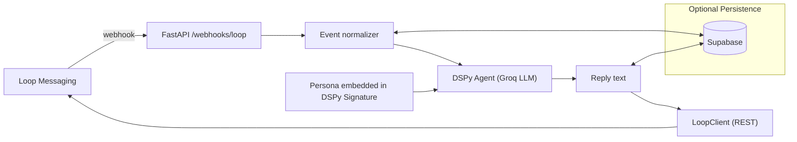

# Loop Messaging Webhook Server with DSPy + Groq

A step-by-step implementation plan to stand up a FastAPI server that:

- Receives inbound messages from Loop Messaging via webhook
- Routes them to a DSPy-based conversational agent configured to use Groq LLMs
- Sends a reply back to the user via Loop Messaging
- Is extensible for additional channels, tools, meta-tools, and sub-agents

This is designed as an incremental plan with clear milestones, tasks, and acceptance criteria.

---

## TL;DR

- Framework: FastAPI + Hypercorn
- AI stack: DSPy orchestrating a Groq-hosted LLM (OpenAI-compatible endpoint)
- Primary endpoint: `POST /webhooks/loop` (receive messages), respond via Loop REST API
- Config via env: `GROQ_API_KEY`, `GROQ_MODEL`, `LOOP_API_KEY`, `LOOP_API_BASE_URL`, `LOOP_WEBHOOK_SECRET` (optional verify), `SUPABASE_URL`, `SUPABASE_KEY` (optional persistence)
- Persona defined directly inside the DSPy Module signature (no external loader)
- Extensible adapters: `MessagingAdapter` for Loop now, later add Slack/SMS/etc.; `ToolRegistry` for tools and sub-agents

---

## Milestones and Deliverables

### M0 — Scaffolding (already partially present)
- FastAPI app and dev server runner (Hypercorn)
- `.env` loading with `python-dotenv`
- Railway deployment config exists (`railway.json`)

Acceptance:
- `GET /` returns a simple JSON and app starts locally with Hypercorn

### M1 — Loop webhook echo
- Add `POST /webhooks/loop` route
- Parse inbound message payload; reply immediately with 200 OK and a basic acknowledgement
- Implement minimal `LoopClient.send_message(...)` with API key auth (mocked in dev)

Acceptance:
- `curl` to webhook returns 200; server logs normalized message
- Optional: test `LoopClient` against a mock or a sandbox

### M2 — DSPy agent (Groq-backed)
- Add DSPy + Groq dependencies
- Configure DSPy to use Groq via OpenAI-compatible API base
- Implement a simple `ChipRespond` DSPy module with a `Signature` for chat

Acceptance:
- A function `generate_reply(user_text)` returns a non-empty model response

### M3 — Wire webhook → agent → Loop
- On inbound Loop webhook: extract sender, conversation id, message text
- Call DSPy agent with embedded persona
- Call DSPy agent → produce reply
- Send reply back via `LoopClient`

Acceptance:
- End-to-end: POST inbound payload → outbound message is sent (or logged if in dev emulation)

### M4 — Persona refinement (embedded)
- Refine persona inside the DSPy Signature docstring (concise, high-signal)
- Tune temperature and token budgets as needed

Acceptance:
- Persona docs loaded at app start; agent prompts include persona summary

### M5 — Persistence (optional in v1, recommended)
- Use Supabase to store conversations/messages for continuity and audit
- Simple schema and DAO; fall back to in-memory store if not configured

Acceptance:
- Messages persisted when Supabase env vars exist; in-memory works otherwise

### M6 — Extensibility hooks
- Define `MessagingAdapter` interface and register Loop as first adapter
- Define `Tool` and `ToolRegistry`; add a no-op sample tool
- Sketch `SubAgent` interface for multi-agent orchestration (future)

Acceptance:
- New adapters/tools can be registered without changing core webhook logic

### M7 — Testing, Observability, Deployment
- Unit tests for agent and adapter; contract test for webhook
- Structured logging; basic error handling and retries for Loop API
- Railway deployment with env vars; health endpoint and readiness

Acceptance:
- All tests pass locally; service deploys to Railway; health checks pass

---

## Architecture (high level)



---

## API Surface

- `GET /healthz`
  - 200 OK with `{ status: "ok" }`

- `POST /webhooks/loop`
  - Headers: `Content-Type: application/json`; optional signature header (e.g., `X-Loop-Signature`)
  - Body: Loop message event (see Example Payload)
  - Result: 200 OK as quickly as possible; enqueue or inline reply logic in v1

Example payload (shape illustrative; confirm with Loop docs):

```json
{
  "event": "message.created",
  "data": {
    "conversationId": "conv_123",
    "message": {
      "id": "msg_abc",
      "text": "Hi Chip!",
      "from": { "channel": "sms", "address": "+12025550123" },
      "to":   { "channel": "sms", "address": "+12025550999" },
      "timestamp": "2025-01-01T12:00:00Z"
    }
  }
}
```

---

## Configuration (env vars)

- `GROQ_API_KEY`: Groq API key
- `GROQ_MODEL`: e.g., `llama-3.1-70b-versatile` (choose any Groq-supported model)
- `OPENAI_API_BASE`: `https://api.groq.com/openai/v1` (OpenAI-compatible)
- `LOOP_API_BASE_URL`: e.g., `https://api.loopmessage.example/v1` (placeholder)
- `LOOP_API_KEY`: Loop API key for sending messages
- `LOOP_WEBHOOK_SECRET`: Secret used to verify webhook signatures (if available)
- `SUPABASE_URL`, `SUPABASE_KEY`: Optional persistence
  (No persona files; persona is embedded in code)

Local `.env` example:

```
GROQ_API_KEY=...
GROQ_MODEL=llama-3.1-70b-versatile
OPENAI_API_BASE=https://api.groq.com/openai/v1
LOOP_API_BASE_URL=https://api.loop.example/v1
LOOP_API_KEY=...
LOOP_WEBHOOK_SECRET=...
SUPABASE_URL=...
SUPABASE_KEY=...
# (no persona env needed; persona embedded in code)
```

---

## Dependencies to add

Using `uv` (preferred in this repo):

```bash
uv add dspy-ai groq httpx pydantic-settings
```

Notes:
- DSPy can talk to Groq via the OpenAI-compatible endpoint. We'll use `dspy.OpenAI(...)` with `api_base` pointing at Groq.
- `httpx` is already brought in transitively; we’ll use it for Loop client explicitly if needed.

---

## Proposed file layout (incremental)

Keep `main.py` for now, add modules gradually:

```
app/
  adapters/
    loop.py           # LoopClient and payload normalization
  agents/
    dspy_agent.py     # DSPy config + ChipRespond module
  (no `persona/` package; persona is embedded in DSPy module)
  routers/
    loop_webhook.py   # POST /webhooks/loop
    health.py         # GET /healthz
  models/
    events.py         # Pydantic models for webhook payloads
    messages.py       # Normalized message model
  store/
    memory.py         # In-memory store (dict by conversationId)
    supabase.py       # Optional persistence adapter
  tools/
    registry.py       # Tool interface + registry (future-ready)
  config.py           # settings via env
main.py               # FastAPI app init + router includes
```

---

## Minimal implementations (sketches)

### DSPy + Groq configuration (persona embedded)

```python
# app/agents/dspy_agent.py
import os
import dspy

def configure_dspy() -> None:
    lm = dspy.OpenAI(
        model=os.getenv("GROQ_MODEL", "llama-3.1-70b-versatile"),
        api_base=os.getenv("OPENAI_API_BASE", "https://api.groq.com/openai/v1"),
        api_key=os.environ["GROQ_API_KEY"],
    )
    dspy.settings.configure(lm=lm, input_token_limit=8000, output_token_limit=1024)


class ChatSignature(dspy.Signature):
    """Respond as Chip, a helpful, friendly Alabama tech community agent.

    Chip is warm, concise, and practical. Prefer actionable next steps,
    short paragraphs, and a welcoming tone. If you don't know, say so and
    propose how to find out. Avoid over-promising.

    user_message: The latest user message from the user
    """
    user_message = dspy.InputField()
    reply = dspy.OutputField()


class ChipRespond(dspy.Module):
    def __init__(self) -> None:
        super().__init__()
        self.generate = dspy.Predict(ChatSignature)

    def forward(self, user_message: str) -> str:
        return self.generate(user_message=user_message).reply


_configured = False

def generate_reply(user_message: str) -> str:
    if not _configured:
        configure_dspy()
    return ChipRespond()(user_message=user_message)
```

### Persona loader

Removed — persona is embedded inside the DSPy module signature.

### Loop client (placeholder)

```python
# app/adapters/loop.py
import os
import httpx
from typing import Any


class LoopClient:
    def __init__(self) -> None:
        self.base = os.environ.get("LOOP_API_BASE_URL", "")
        self.key = os.environ.get("LOOP_API_KEY", "")

    def _headers(self) -> dict[str, str]:
        return {"Authorization": f"Bearer {self.key}", "Content-Type": "application/json"}

    def send_message(self, to: str, text: str, conversation_id: str | None = None) -> Any:
        if not self.base:
            # Dev fallback: log-only
            print({"to": to, "text": text, "conversationId": conversation_id})
            return {"status": "logged"}
        payload = {"to": to, "text": text, "conversationId": conversation_id}
        with httpx.Client(timeout=10) as client:
            r = client.post(f"{self.base}/messages", headers=self._headers(), json=payload)
            r.raise_for_status()
            return r.json()
```

### Webhook router (persona embedded)

```python
# app/routers/loop_webhook.py
from fastapi import APIRouter, Request
from app.agents.dspy_agent import generate_reply
from app.adapters.loop import LoopClient

router = APIRouter()


@router.post("/webhooks/loop")
async def loop_webhook(request: Request):
    body = await request.json()
    data = body.get("data", {})
    msg = data.get("message", {})
    user_text = msg.get("text", "")
    to_address = msg.get("from", {}).get("address")
    conversation_id = data.get("conversationId")

    reply = generate_reply(user_message=user_text)

    client = LoopClient()
    client.send_message(to=to_address, text=reply, conversation_id=conversation_id)

    return {"ok": True}
```

### App wiring

```python
# main.py (additions)
from fastapi import FastAPI
from app.routers.loop_webhook import router as loop_router

app = FastAPI()
app.include_router(loop_router)

@app.get("/healthz")
async def healthz():
    return {"status": "ok"}
```

---

## Optional: Supabase schema (for persistence)

Use a minimal schema to append messages and sessions:

```sql
create table if not exists conversations (
  id uuid primary key default gen_random_uuid(),
  conversation_id text not null,
  channel text not null,
  created_at timestamp with time zone default now()
);

create table if not exists messages (
  id uuid primary key default gen_random_uuid(),
  conversation_id text not null,
  direction text check (direction in ('in','out')) not null,
  sender text,
  recipient text,
  body text,
  raw jsonb,
  created_at timestamp with time zone default now()
);
```

Add a simple DAO with `insert_message(...)`, `list_recent_messages(conversation_id, limit)` to feed limited history to the agent.

---

## Security, Reliability, Observability

- Webhook verification: If Loop provides a signature header, validate with `LOOP_WEBHOOK_SECRET`
- Idempotency: Use `message.id` for deduplication (store processed ids for a time window)
- Timeouts/retries: Outbound POST to Loop with backoff; avoid infinite retries
- PII hygiene: Avoid logging raw phone numbers; or mask them
- Rate limiting: Optional FastAPI middleware or upstream (Railway)
- Structured logs: JSON logs for webhook events and outbound requests

---

## Local development

1) Install deps

```bash
uv sync
uv add dspy-ai groq
```

2) Run

```bash
hypercorn main:app --reload --log-level debug
```

3) Test webhook

```bash
curl -X POST http://localhost:8000/webhooks/loop \
  -H 'Content-Type: application/json' \
  -d '{
        "event":"message.created",
        "data":{"conversationId":"conv_123","message":{"id":"msg_1","text":"Hello","from":{"channel":"sms","address":"+12025550123"}}}
      }'
```

---

## Tests (outline)

- Unit: DSPy agent returns a string for a stub prompt (mock Groq)
- Unit: DSPy signature persona produces tone/structure as expected (stub/mocked)
- Unit: LoopClient builds requests and handles errors (use `respx` or `httpx.MockTransport`)
- Contract: POST webhook with sample payload triggers LoopClient call

### Implemented test matrix

- Health endpoint and root route behavior without Supabase
- Loop adapter send_text for individual and group, including reply_to_id, passthrough, service, timeout
- Loop adapter normalization for native Loop webhooks and internal testing shape
- Adapter registry get/register/unknown cases
- Webhook route:
  - Authorization required
  - Happy path for native inbound event including outbound send
  - Internal testing shape with and without recipient
  - Agent failure surfaces 500, send failure surfaces 502

LLM interactions are stubbed via a small context manager in `tests/conftest.py` to avoid network I/O.

---

## Extensibility: adapters, tools, sub-agents

- `MessagingAdapter` interface: `send_message()`, `normalize_event()`, `verify_signature()`
- `Tool` protocol: `name`, `describe()`, `invoke(input) -> output`, with registration via `ToolRegistry`
- `SubAgent` interface: name, specialization, `respond(query, context)`; orchestrated by a router agent (future)

Planned tools (future):
- Search, Knowledge-base lookup, Calendar, Task runner

---

## Definition of Done (v1)

- Inbound Loop webhook accepted and parsed
- DSPy+Groq agent returns a reply using persona context
- Outbound reply sent via Loop client (or logged in dev)
- Health endpoint, basic logs, and error handling present
- Deployable on Railway with documented env vars

---

## Notes and open items

- Confirm Loop Messaging REST and webhook specs (endpoints, auth, signature)
- Choose the exact Groq model and temperature defaults
- Persona lives in code; refine the signature docstring as needed
- Decide whether to inline agent call (v1) or enqueue via background tasks / queue

---

This plan is intentionally incremental. Start with the minimal echo flow (M1), then layer in DSPy (M2) and wiring (M3). Add persona (M4), optional persistence (M5), and the extensibility scaffolding (M6). Finish with tests and deployment hardening (M7).


